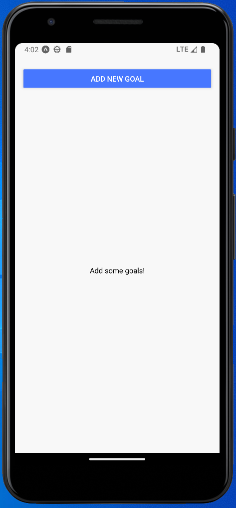
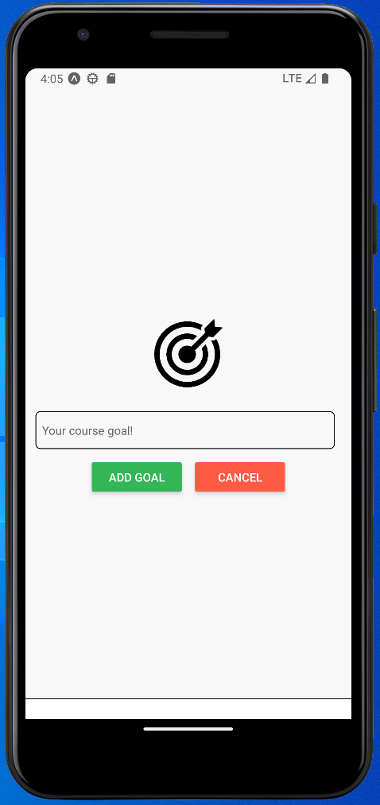
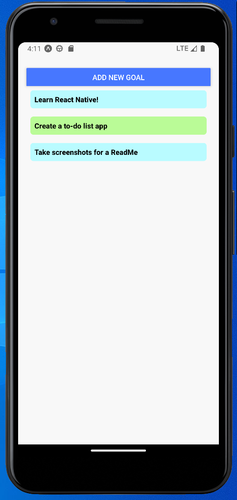

# First React Native Project - Basic To-do List App

This is the application I created while following **[this](https://www.youtube.com/watch?v=VozPNrt-LfE)** tutorial video, created by Maximilian Schwarzmüller. It was my introduction to **React Native**. While I have worked on web applications that have been optimised for mobile viewing in the past, this was my first time creating an application that was native to mobile platforms, which I found a refreshing experience.

**Technologies Used** - React Native, React.js, JavaScript

**Duration** - 1 Day

## App Walkthrough

The app is very simple. You simply tap on the 'Add new goal' button, after which a text input appears that allows you to write a custom goal. After tapping the 'Add Goal' button, you are taken back to the goal list page, now showing the goal you've entered.

## Things Learned

The whole project was a learning experience, as I'm new to React Native. However, there were some concepts in particular that stood out.

### Lazy Loading

The tutorial did a very good job explaining the concept of lazy loading, and showing which situations it is useful. The React Native component `<FlatList>` meant the app is protected against performance issues that may arise from the task list being populated with a large amount of tasks.

### React Native Styling

I found styling in React Native to be surprisingly intuitive, despite being quite different to CSS and SASS. While the lack of cascading takes a while to get used to, being able to apply styling directly in the JavaScript code using `<Stlyesheet>` seems very logical to me.

### Easy multi-platform development using Expo

I was very impressed with how easily I was able to start a project in Expo, checking the App after each save on both Android and Apple systems. I found it invaluable to see the differences between the two Operating Systems in that live context.

### Differences between developing for Android and iOS

I was very impressed with the quality of the documentation for React Native, especially in how it demarcates which features work for iOS and Android. I made use of the 'Android Ripple' effect on the `<Pressable>` components that made up the Task List, but due to the lack of compatibility with iOS, I used a simple Style change for iOS.

## Takeaways and Ideas for Expanding

Since finishing this app, I have decided to purchase and continue learning React Native from Max Schwarzmüller, as I thought his teaching style was very effective, and React Native is a framework that I would like to continue to learn more about. I'm not sure if the rest of Max's course focuses on expanding this app, or if it starts a new app, but this is the list of ideas I had for expanding the app.

- Allow users to edit tasks
- Priority ratings for tasks, colours to reflect priority on the task list
- Add deadlines for tasks
- Allow tasks to be sorted - Sort by date added, alphabetical order, deadline date, priority
- Allow grouping of tasks and/or subtasks
- Building a backend and login feature to allow tasks to be stored centrally and accessed on multiple devices.

## App Screenshots

**Empty Goal List**

**Add Goal Modal**

**Populated Goal List**

